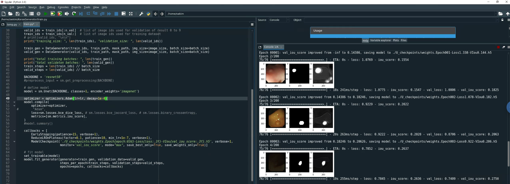
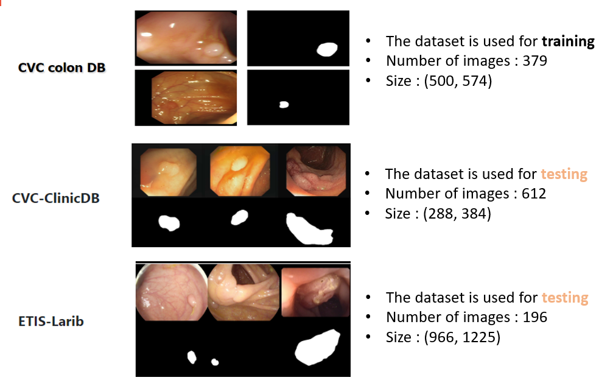
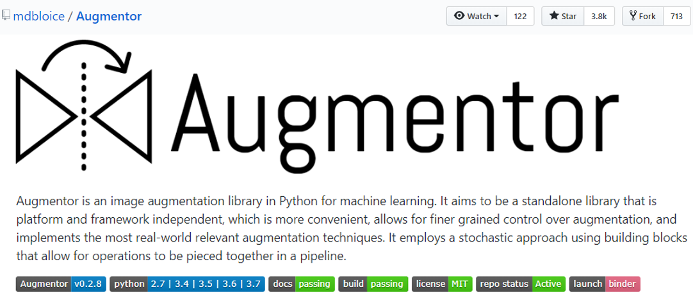
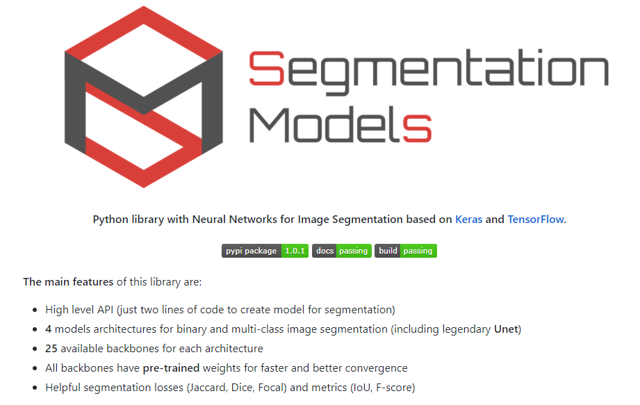
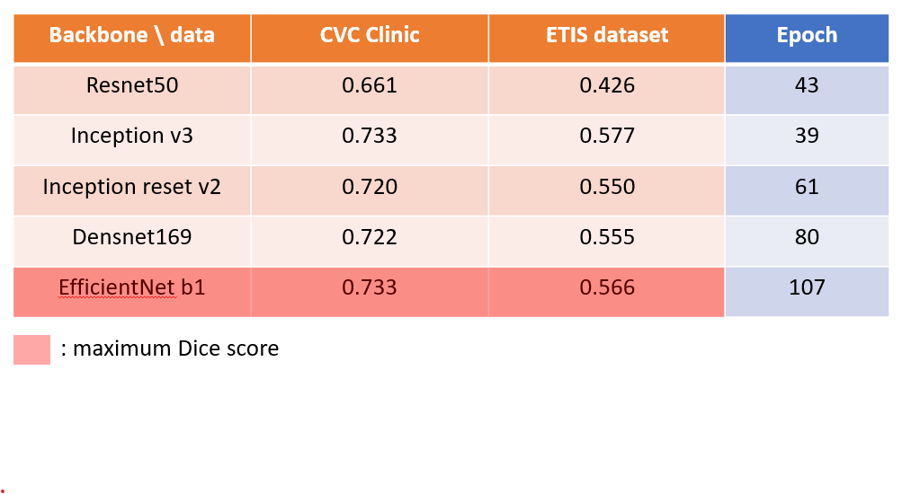
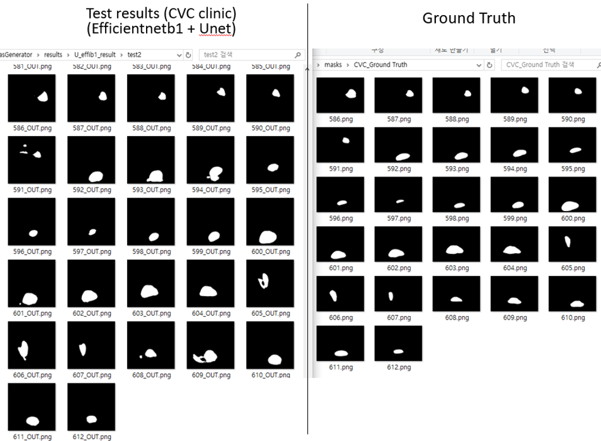

## Polyp Segmentation

1. Pytorch Model

   1-1. U-net + [residual, ASPP, CBAM, Up-Attention] parts

   -> [residual+ASPP](https://www.researchgate.net/publication/328682314_Urban_Land_Use_and_Land_Cover_Classification_Using_Novel_Deep_Learning_Models_Based_on_High_Spatial_Resolution_Satellite_Imagery), [CMAB](https://arxiv.org/abs/1807.06521), [Up-Attention](https://arxiv.org/abs/1804.03999)

   1-2. Based on [this paper](https://arxiv.org/abs/1912.11947)(Colorectal Polyp Segmentation by U-Net with Dilation Convolution)

   and, use dice loss.  

   ------

   

2. Keras Model

   Both two versions implemented based on 'U-net' and I changed 'backbone', resnet50, densnet, efficientnet etc..

   The difference is 'how to load data and make batches'

   2-1. Implemented using 'keras.utils.sequence' and 'fit_generator'

   -> If you want to plot the validation results in running code, refer to [this content](https://sunshower76.github.io/frameworks/2020/02/09/Keras-Batch%EC%83%9D%EC%84%B1%ED%95%98%EA%B8%B02-(Sequence-&-fit_gernator)-%EC%A4%91%EA%B0%84%EA%B2%B0%EA%B3%BC%ED%99%95%EC%9D%B8/](https://sunshower76.github.io/frameworks/2020/02/09/Keras-Batch생성하기2-(Sequence-&-fit_gernator)-중간결과확인)  like below.

   

   2-2. Implemented using 'keras.utils.sequence' and 'train_on_batch'
   -> **It has memory overflow problem as training progresses**  

   ------

   

3. Informations

- Dataset

  

  [Endoscopic vision challenge](https://polyp.grand-challenge.org/Databases/), [CVC Colon dataset](http://mv.cvc.uab.es/projects/colon-qa/cvccolondb)

  but,  **There are some noises in dataset so, you must refer to** [this link](https://github.com/sunshower76/Polyp-Segmentation/tree/master/data/DataPreProcessing) **and you must eliminate these noises**

    

- Data Augmentation

  These datasets have a few number of images so, data augmentation should be needed

  I used these open source. [Augmentor](https://github.com/mdbloice/Augmentor)

  

    

- Pretrained backbone

  I use pretrained backbone with IMAGENET. In case of 'pytorch', I used  [PytorchHub](https://pytorch.org/docs/stable/hub.html) and case of 'keras' I used open source [segmentation models](https://github.com/qubvel/segmentation_models)

  

    

- Results
  Pytorch models show low performance 'Unet + extraparts' show lowest performance and another model show similar performance to 'Resnet50 + U-net' that is implemented keras.

  Here is the results of  Unet model with various backbones that is implemented with Keras.

  

